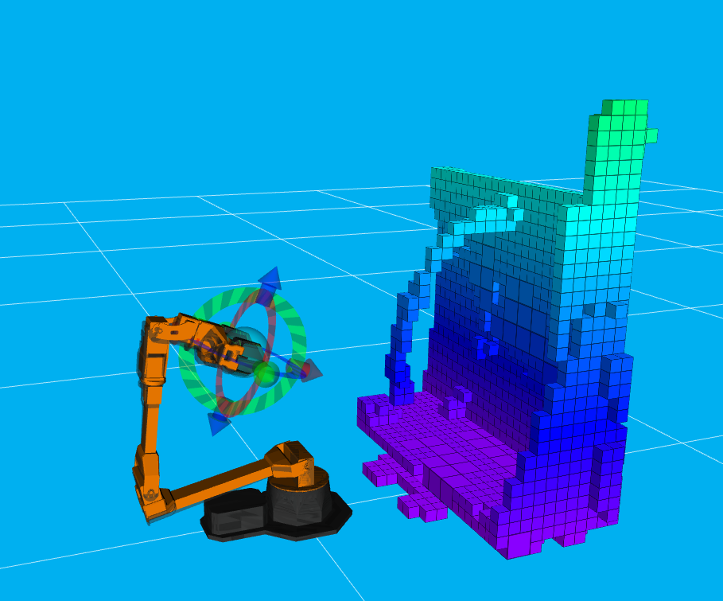

# Space Habitat Robotics Framework

The Space Habitat Robotics Framework is a versatile and powerful tool designed to facilitate complex manipulation tasks in the context of space habitats. By offering a collection of fundamental robotic actions that can be orchestrated to accomplish tasks, this framework serves as a foundational solution for robotics projects within the unique challenges of space environments. The framework leverages established technologies like Moveit and ROS (Robot Operating System) to provide a seamless interface for controlling robotic actions.

## Demonstration

### Multiple Objects Manipulation

*Robot first scans the scene to generate an octomap of the environment and locate objects with ArUco markers. Then, it performs a pick and place sequence.*

### Avoiding Obstacles

*The robot navigates around a wire to grasp an object. The robot avoids the wire since it can scan it and form an octomap of the scene.*

### Grasping a Cylinder

*The robot demonstrates the ability to pick a variety of different object primitives, such as a cylinder.*

### Octomap Generated by MoveIt

*The octomap of the scene after scanning, generated using the MoveIt framework.*

## Note
This repository is no longer actively maintained and was developed during a learning phase focused on ROS (Robot Operating System) and MoveIt. While the code and demonstrations provided here showcase concepts related to robotics, manipulation, and environment mapping, please be aware that it might not be up-to-date or optimized for production use. Feel free to explore and learn from the content, but consider consulting more recent resources for current best practices and advancements in the field of robotics.

## Key Features

### Primitive Robotic Actions

At the heart of the framework are primitive robotic actions that have been meticulously crafted using the Moveit library. These actions are integral components that can be utilized independently or combined to execute intricate tasks. Each action encapsulates a specific robotic behavior and can be seamlessly integrated into various applications.

### Class and ROS Action Interfaces

To cater to different usage scenarios, the framework offers two distinct interfaces for accessing the primitive robotic actions. The first interface involves a Class-based approach, allowing users to directly interact with and program robots using the provided ManipulationPrimitive Class. This offers a fine-grained level of control for those who prefer a programmatic approach.

The second interface employs ROS Actions, a mechanism within ROS that enables the execution of tasks in a distributed and asynchronous manner. The ManipulationActionServer Class encapsulates the primitive robot functions and exposes them as ROS Actions. This means that tasks can be initiated by sending requests to the respective Action servers, making it easier to manage complex actions and sequences.

### Behavior Trees for Task Sequencing

Sequencing and coordinating multi-step tasks is made efficient through the integration of Behavior Trees. Behavior Trees provide a high-level control structure that orchestrates the execution of various ROS Actions. Each node in the Behavior Tree corresponds to a specific action, and the tree's structure defines the order and conditions for their execution. This architecture streamlines the process of defining and executing complex robotic behaviors.

## Package Overview

### shr_manipulation

This package forms the foundation of the Space Habitat Robotics Framework and contains three key files:

- `manipulation_primitives.py`: Defines the ManipulationPrimitive Class, which utilizes Moveit to construct primitive robot functions. These functions are directly accessible for user programming.

- `manipulation_action_server.py`: Extends the ManipulationPrimitive Class and encapsulates the primitive robot functions within a ROS Action Interface. This approach simplifies execution by utilizing ROS Action servers for each robot function.

- `grasp_planner.py`: Houses the GraspPlanner Class, offering the 'grasp_planning_service' ROS2 service. This service enables grasp planning for robotic arms based on object-specific information and prior knowledge.

Additionally, the `/launch/bringup_arm.launch` file serves as the central launch point for initiating Moveit, manipulation action servers, grasp planner, and vision nodes.

### shr_interfaces

The `shr_interfaces` package provides essential definitions for action and service messages used throughout the framework. It also includes various .yaml files that pertain to components like april_tag nodes and object databases.

### shr_vision

Within this package, you'll find nodes responsible for incorporating objects into the planning scene from the database. These nodes facilitate the integration of external objects for manipulation tasks.

### shr_behavior_trees

This package focuses on Behavior Trees, offering a structured approach to task sequencing. Key components include:

- `/src/nodes`: Contains Behavior Tree nodes, each corresponding to a ROS Action provided by the ManipulationActionServer Class. These nodes contain the necessary ROS Action clients for calling the associated ROS action servers.

- `test_bt.cpp`: The main executable that registers behavior tree nodes from `/src/nodes`, loads a user-defined .xml file describing the desired Behavior Tree, and executes the tree accordingly.

- `behavior_tree_server.cpp`: Functions as a ROS Action server, encapsulating the content of `test_bt.cpp`. It accepts the name of a Behavior Tree .xml file to facilitate the execution of different Behavior Trees.

The `/bt_xml` directory holds the .xml files that describe distinct Behavior Trees, and the `/launch/my_bt.launch` file demonstrates how to input a .xml file from `/bt_xml` into `test_bt.cpp` to execute a Behavior Tree.

## Conclusion

The Space Habitat Robotics Framework provides an organized and comprehensive solution for addressing the challenges of robotic manipulation in space habitats. By combining primitive robotic actions, versatile interfaces, and Behavior Trees, this framework empowers users to accomplish intricate tasks with efficiency and control. Through its modular architecture and integration with established technologies, the framework is well-suited to enable a wide range of robotic applications in space exploration.